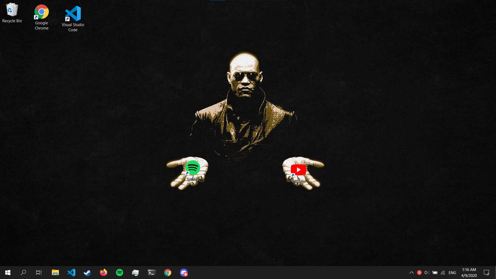
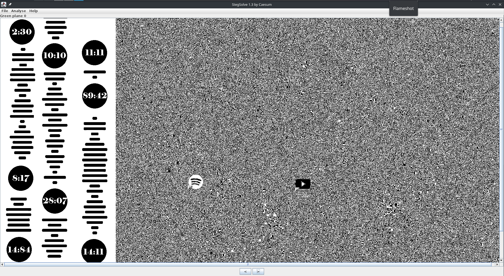
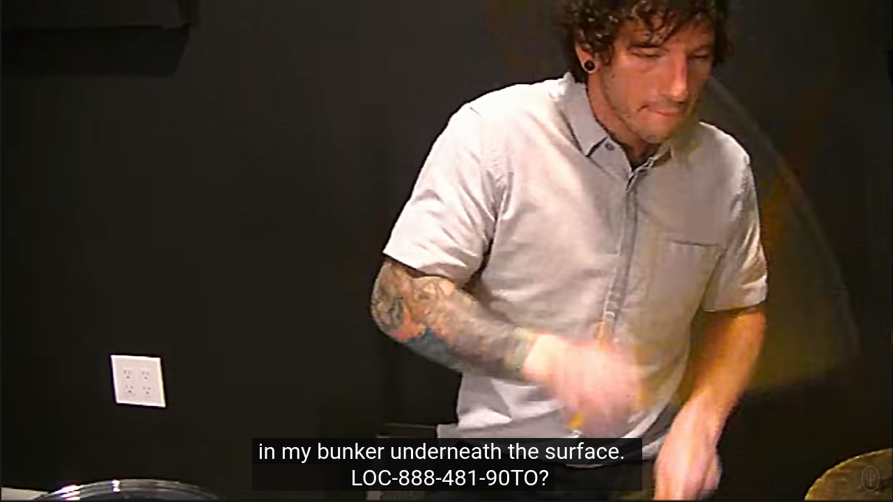

# Mike - Forensics

Author - [Sanjay Baskaran](http://github.com/sanjaybaskaran01)

Tag : Forensics, OSINT

---
## Source

```
Julia has come to you to ask for help. After spending too much time on his computer, Mike has gone insane, but no one knows why. Can you figure it out? Julia would really appreciate it. Here's how his desktop looked like. Weird how his system time doesn't change..

Wrap the flag that you find with dsc{<flag>}!
```
<p align="center">

</p>

## Exploit

In the challenge they have mentioned how `his system time doesn't change` keeping this in mind for the later stage of the exploit, we have no luck with the usual exploits `strings desktop_wallpaper.png` or the `meta data` of the file. We could see that the image quality  or the pixels of the image seem disturbed, using `stegsolve` on the image leads to..

<p align="center">

</p>

The barcode seems to be a `spotify barcode` and when we scan them they lead to `Level of Concern by Twenty One Pilots`

Now keeping in mind about how the system time does not change for Mike's computer, we fast forward to the exact timestamp of `1:16` in the song which did not help much. Looking back at the image given, everyone who has seen the Matrix knows that Neo picks the red pill when given a choice. So we go through the `youtube` video of `Level of Concern by Twenty One Pilots` and at the exact timestamp of `1:16` in the captions we find..

<p align="center">

</p>

The flag is

```
dsc{LOC-888-481-90TO}
```