# Teg Rads - Forensics

Author - [Sanjay Baskaran](http://github.com/sanjaybaskaran01)

Tag : Forensics , Cryptography

Requirements: Binwalk

---
## Source

```
Most of the times, what you seek is deep within the user. It starts with a writer, carries on with an actor and ends with a producer.
```
<p align="center">

</p>

## Exploit

Investigating the given pdf `fdp.pdf`, in an attempt to find hidden texts in the pdf trying ctrl+a gives us

<p align="center">
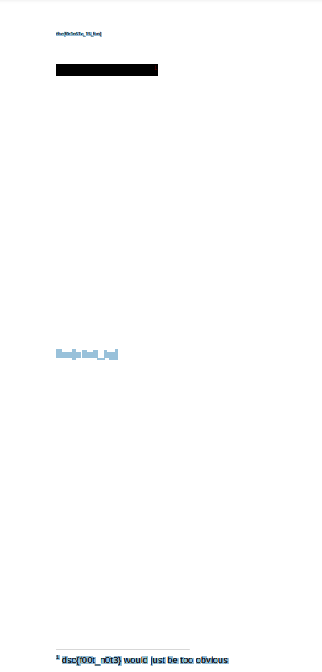
</p>

`dsc{f0r3n51x_15_fun} dsc{n0t_h3r3_31th3r} 1 dsc{n1c3_try} 1 dsc{f00t_n0t3} would just be too obvious`
and ofcourse none of them were the flags.

Running the command `strings fdp.pdf` gave us
<p align="center">
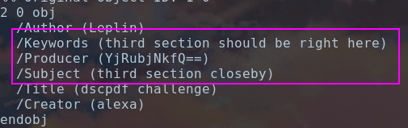
</p>

which seem to be a base64 encoded string, since the description of the challenge says  `It starts with a writer, carries on with an actor and ends with a producer` this meant that the producer is the last part of the flag
<p align="center">
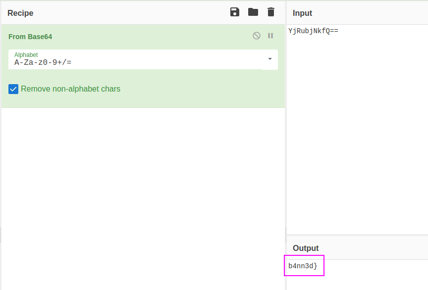
</p> 

and decoding it got us `b4nn3d}` , which looks like the last part of the flag! diving more into the `strings` of the file we see

<p align="center">
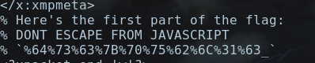
</p>
Which seems to be an URI encoded component and decoding it gives us
<p align="center">
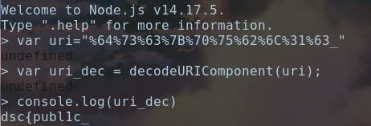
</p>

`dsc{public_` the first part of the flag. 

Scrolling down further on strings we find the third part of the flag

<p align="center">
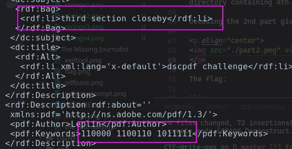
</p>

Decoding the binary we get `0f_` 
<p align="center">
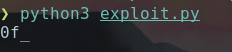
</p>

This text in strings informs us that there are 5 parts of the flag.

<p align="center">
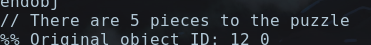
</p>


and towards the end of the `strings` we find this 

<p align="center">
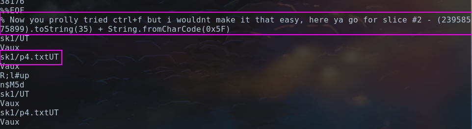
</p>

which gives us the 2nd part of the flag and tells us that there is a hidden directory containing 4th part of the flag.

Decoding the 2nd part gives us `d15pl4y_`

<p align="center">
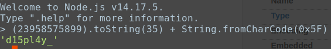
</p>

Running binwalk on the pdf and navigating to the 4th part of the flag we find a text file
<p align="center">
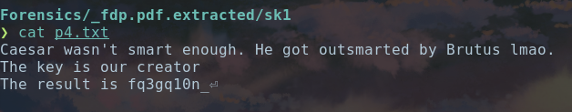
</p>

Decoding the 4th part of the flag in Vigenere Cipher with key as "alexa" (Since alexa is creator of the PDF)
<p align="center">
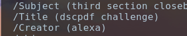
</p>
<p align="center">
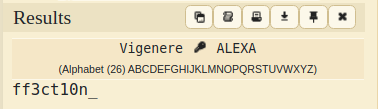
</p>

We finally get all parts of the flag!


The flag is:

```
dsc{publ1c_d15pl4y_0f_ff3ct10n_b4nn3d}
```