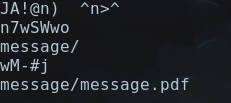
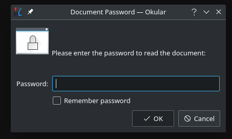
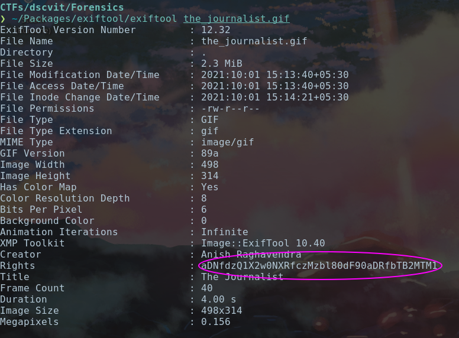
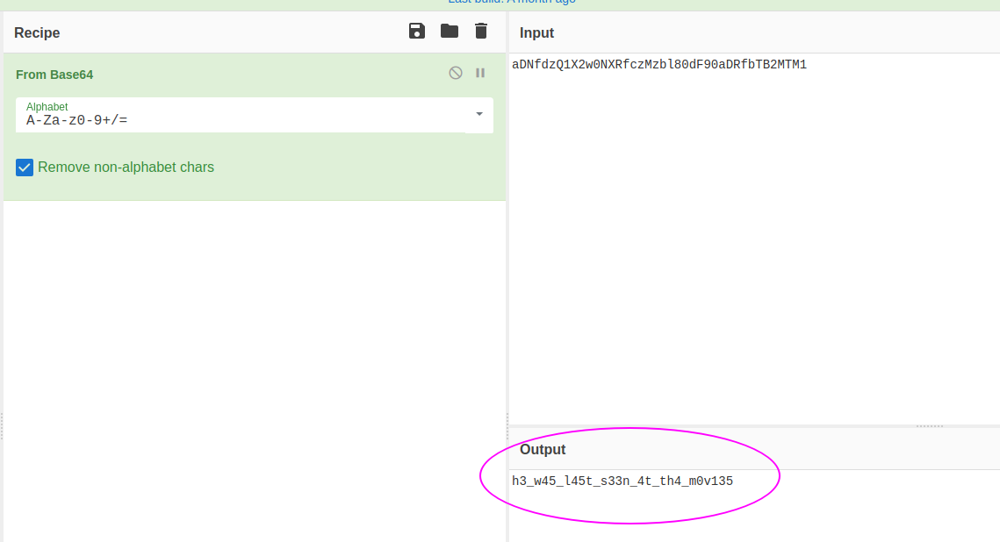
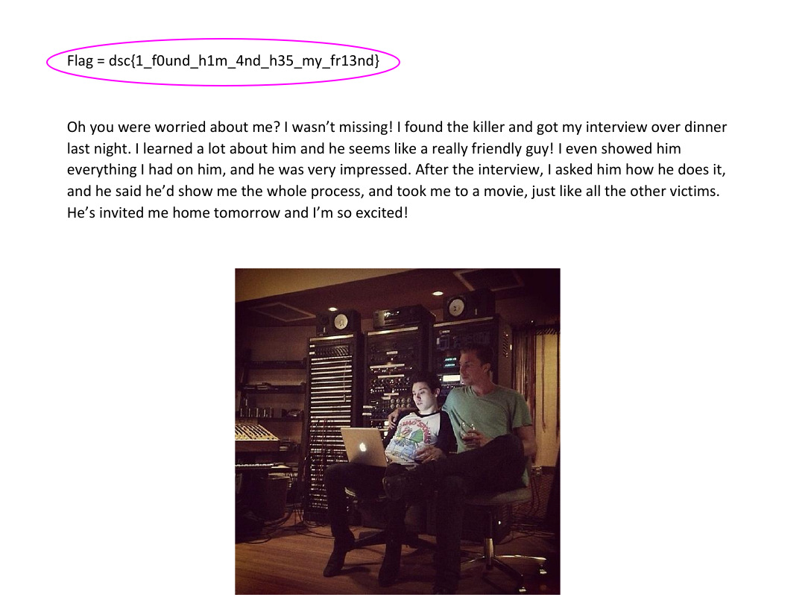

# The Missing Journalist - Forensics

Author - [Sanjay Baskaran](http://github.com/sanjaybaskaran01)

Requirements: Binwalk,exiftool

---
## Source

```
It's been a year since you've been a private investigator and you've made quite a name for yourself. You sit there thinking about all the weird cases you've managed in the last year when suddenly, a person bursts through your door saying something about her missing husband. You finally gather that her husband, a renowned journalist who was tracking down a serial killer has suddenly gone missing since last night. The hysterical wife has provided you with a picture of how he looks like. Do you take the case?
```
<p align="center">

</p>

## Exploit

Running the command `strings the_journalist.gif` gave us 

<p align="center">

</p>

As you can see there was a hidden directory `message/`, We used binwalk to extract the hidden files in the GIF. The PDF present inside was password protected. 

<p align="center">

</p>

Running exiftool on the GIF gave us 
<p align="center">

</p>

which seemed to be a base64 encoded string 
<p align="center">

</p>

Decoding it got us "`h3_w45_l45t_s33n_4t_th4_m0v135`" and voila! this was the password of the PDF and that finally gave us..
<p align="center">

</p>

The flag:

```
dsc{1_f0und_h1m_4nd_h35_my_fr13nd}
```