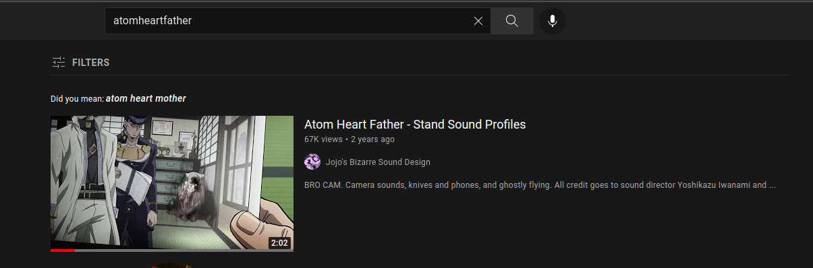
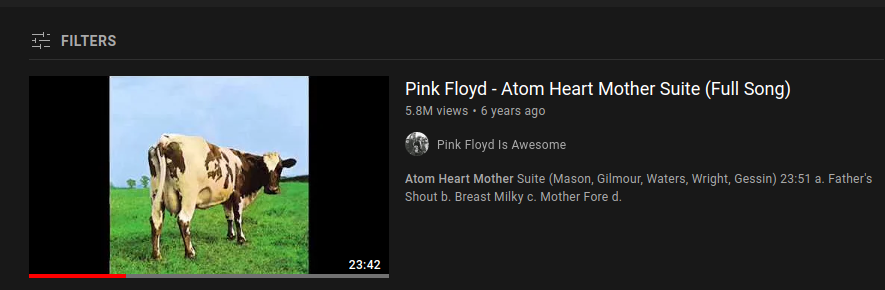
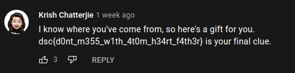

# AHF - OSINT

Author - [Sanjay Baskaran](http://github.com/sanjaybaskaran01)

Requirements : Know how to Google


---
When we open the challenge we are greeted with 

>We've been listening and we've heard this group can write decent code (ahem ahem),but what have they been listening to?


The [PDF](./team.pdf) included pictures of the team "Atom Heart Father" and their names.


We first start up by checking all the user's Spotify (Maybe the flag was in the user's playlist's description) / GitHub (Maybe a project that the team had developed) but that led nowhere. 

Finally trying on Youtube gives us Atom Heart Mother as a suggestion which could be a song that they were listening to.

<p align="center">

</p>


<p align="center">

</p>

and finally in the comments of [Pink Floyd - Atom Heart Mother Suite (Full Song)](https://www.youtube.com/watch?v=Fku7hi5kI-c) we have
<p align="center">

</p>

The flag is

```
dsc{d0nt_m355_w1th_4t0m_h34rt_f4th3r}
```