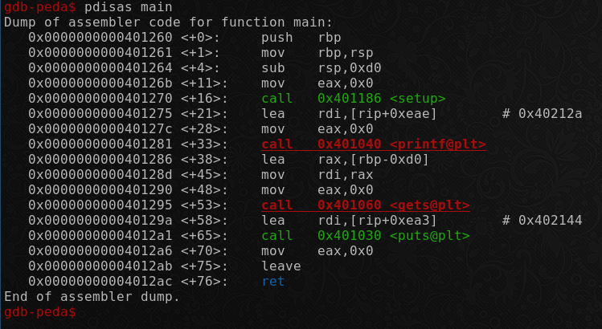
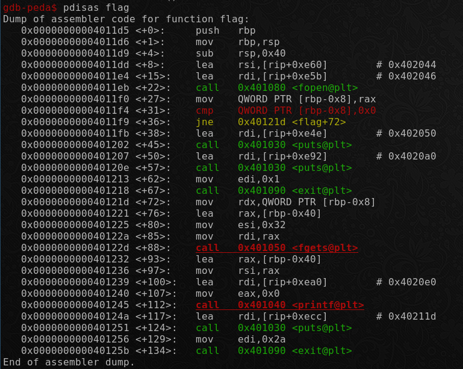
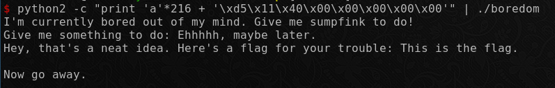

# Boredom

This is a classic buffer overflow challenge. In a nutshell, the `return pointer` of the `main()` function needs to be overwritten with the address of the `flag()` function, which reads the flag from `flag.txt` and prints it to `stdout`.

# Requirements

- GDB ([GNU Debugger](https://www.gnu.org/software/gdb/))
- Basic Knowledge of C Programming
- Basic Knowledge of Assembly and Stacks in Memory

# Source

- The challenge was originally hosted [here](https://ctf.hsctf.com/challenges#Boredom).
- The pre-compiled binary is present in the same directory. 
- The [C program](./boredom.c) is as follows:

```c
#include <stdio.h>
#include <stdlib.h>
#include <unistd.h>
#include <string.h>
#include <sys/types.h>
#include <signal.h>

void setup() {
  puts("I'm currently bored out of my mind. Give me something to do!");
  setvbuf(stdin, NULL, _IONBF, NULL);
  setvbuf(stdout, NULL, _IONBF, NULL);
}

void flag() {
  FILE *f = fopen("flag.txt", "r");
  char buf[50];
  if (f == NULL) {
    puts("You're running this locally or I can't access the flag file for some reason.");
    puts("If this occurs on the remote, ping @PMP#5728 on discord server.");
    exit(1);
  }
  fgets(buf, 50, f);
  printf("Hey, that's a neat idea. Here's a flag for your trouble: %s\n",
    buf);
  puts("Now go away.");
  exit(42);
}

int main() {
  char toDo[200];
  setup();

  printf("Give me something to do: ");
  gets(toDo);
  puts("Ehhhhh, maybe later.");
  return 0;
}
```

# Exploitation

Looking at the C program, we see that the `flag()` function is the target function that needs to be executed to get the flag. In the `main()` function, a character array `toDo`, consisting of 200 elements is created. In [ASCII](http://www.asciitable.com/), a single character occupies 1 byte in memory, hence this `toDo` array will occupy 200 bytes.
<br />

The `setup()` function prints a constant string. The `gets()` function is used to take user input and store it in the `toDo` variable, and then another constant string is printed.
<br />

The vulnerability to be exploited here is the use of the `gets()` function in the program. The issue with this function is that it does not check the size of the user input. Hence, the user may write more bytes than the size allocated for the variable and overflow the stack space allocated for the function. The target is to write enough characters into `toDo` to write over the space allocated for the `main()` function and the space occupied by the base pointer stored just above it, with random characters. Next on the stack is the return pointer of the `main()` function, which has to be carefully overwritten using the address of the `flag()` function, in order to run it once the execution of the `main()` function is over.
<br />

Here is the dump of the assembler code for the `main()` function.
<br />


<br />

In the third line of the assembler code, `sub rsp,0xd0` is specified, which allocates `0xd0` or 208 bytes on the stack for the `main()` function. The `main()` function has only 1 local variable - `toDo`. Therefore, if we write 208 bytes into the `toDo` array, we reach the previous base pointer stored on the stack. This base pointer is `64 bits or 8 bytes` long, therefore, after writing 216 (208 + 8) random characters, we can now overwrite the return pointer.
<br />

The assembler code for the `flag()` function is as follows:
<br />



Therefore, we know that the starting address of the `flag()` function is `0x00000000004011d5`. So, after writing 216 bytes on the stack, we need to write this address, using [little endian format](https://en.wikipedia.org/wiki/Endianness). Thus, all the bytes in the address need to be typed in reverse, making it `\xd5\x11\x40\x00\x00\x00\x00\x00`. The final payload can be generated using `python 2`, as shown below:

```bash
python2 -c "print 'a'*216 + '\xd5\x11\x40\x00\x00\x00\x00\x00'" | ./boredom
```

Upon executing this locally, we get the following output on `stdout`.
<br />



The same output when piped to the CTF server gives the flag.

> Note: The CTF server is not live anymore.

```bash
python2 -c "print 'a'*216 + '\xd5\x11\x40\x00\x00\x00\x00\x00'" | nc pwn.hsctf.com 5002
```
