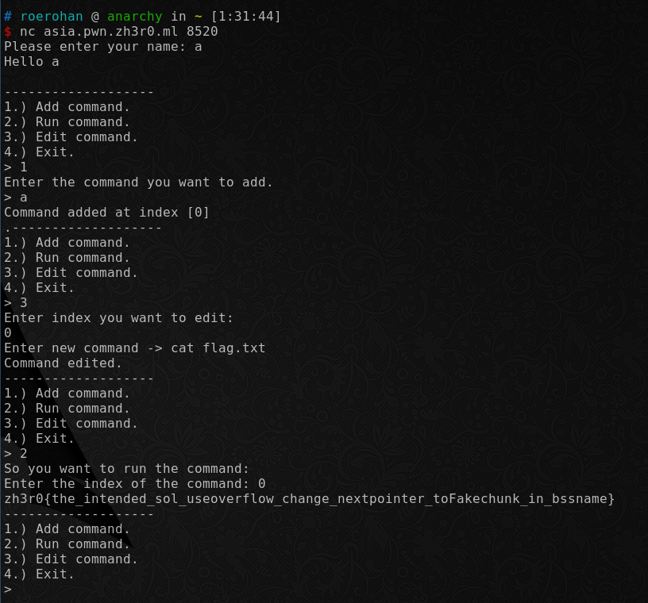

# Command 1

Author: [roerohan](https://github.com/roerohan)

This is an alternate solution to this challenge. The intended solution is not written here.

# Requirements

- None

# Source

- [command_1](./command_1)

# Exploitation

The challenge was intended to be a binary exploit challenge, however, due to a small issue, there was another bug in it. So, when you decompile the code using `ghidra`, you see that the `Add command` option uses `strstr` to block certain strings in the input. But, the same ones are not blocked in the `Edit command` option. The solution seems simple :laugh:.

