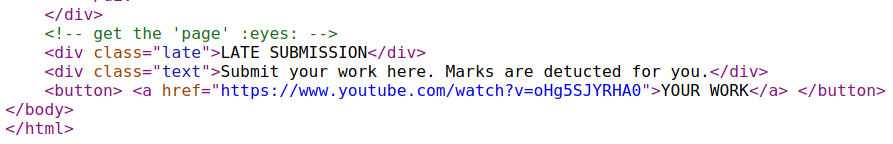
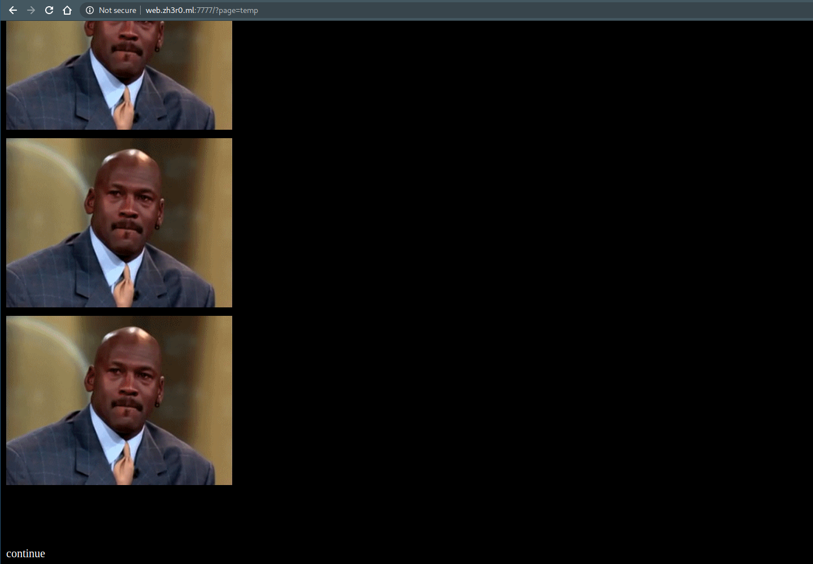
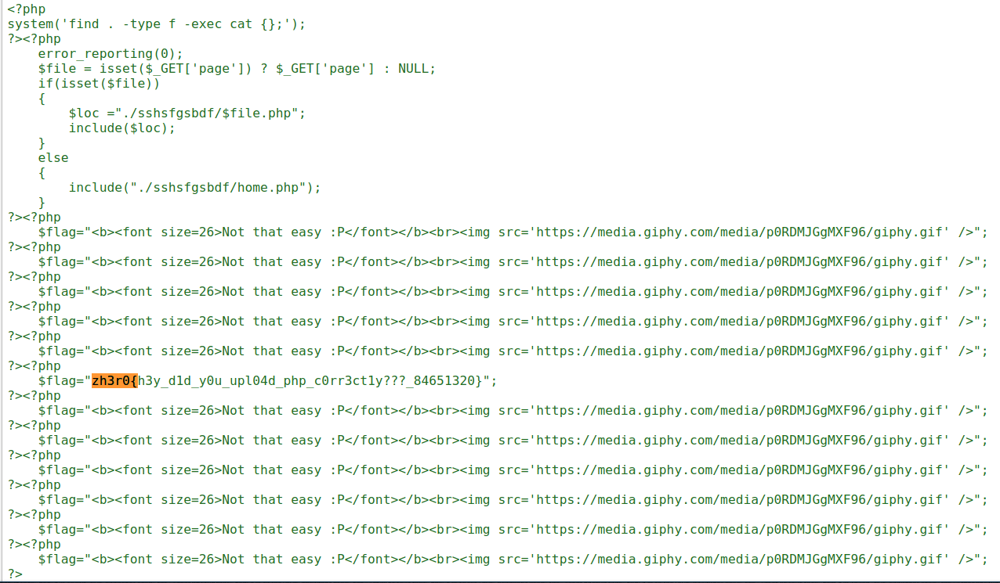

# Challenge Name

Author: [roerohan](https://github.com/roerohan)

Brief Description

# Requirements

- PHP Local File Inclusion (LFI)

# Source

- http://web.zh3r0.ml:7777/
- The description on the website mentions `page` and `upload`.

# Exploitation

The first part of the challenge is a sort of vague guesswork. In the challenge description, there are two words - `page` and `upload` - which the author wants you to notice. Also, when you view the homepage source, it has a comment `<!-- get the 'page' :eyes: -->`. 
<br />



So, the first try was to pass a query `page` in the flag. So, we tried to visit `http://web.zh3r0.ml:7777/?page=flag`. Here, we get a gif.
<br />

Now, since the description had the word `upload` in it, we tried to checkout if there is a page called upload, and there was!
<br />


Here, we can assume that we have to do some sort of local file inclusion. So we created a file called `payload.php`, and tried to `ls` the directory. We saw a lot of files called `flag`, so we just decided to print all files and just search on the browser. Here's the final payload:

```php
<?php
system('find . -type f -exec cat {} +');
?>
```

Now you can visit the route `/?page=payload` (name of the file you uploaded). This gives a page with a lot of stuff.
<br />



So, the contents of all the files are now on the browser. All you have to do is open the source code and search for the flag format.
<br />



The flag is:

```
zh3r0{h3y_d1d_y0u_upl04d_php_c0rr3ct1y???_84651320}
```
