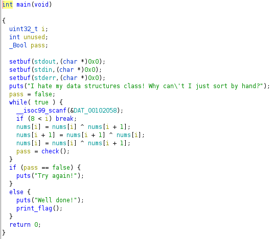

# bubbly

Author: [roerohan](https://github.com/roerohan)

A possible way to solve this challenge is decompiling the binary and trying to understand what's happening in the code.

# Requirements

- ghidra
- gdb

# Source

- [bubbly](./bubbly).

# Exploitation

First, we checkout the decompiled version of this binary with the help of `ghidra`.
<br />



As you see in the code, there is a `while(true)` loop which reads a number `%d` from `stdin` and stores it in `i`. There's also an array of numbers `nums`. The code snippet containing `nums` is basically swapping `nums[i]` with `nums[i+1]`. The `check` function basically checks if the list is sorted. 
<br />

```c
_Bool check(void)

{
  uint32_t i;
  _Bool pass;
  
  i = 0;
  while( true ) {
    if (8 < i) {
      return true;
    }
    if (nums[i + 1] < nums[i]) break;
    i = i + 1;
  }
  return false;
}
```

The target is to keep swapping indices in `nums` to finally sort it as a list. So, we open gdb and find out what nums is.

```bash
gdb-peda$ print nums
$1 = {0x1, 0xa, 0x3, 0x2, 0x5, 0x9, 0x8, 0x7, 0x4, 0x6}
```

When you execute this line in `gdb`, you see that `nums` is a global array, consisting of numbers from 1 to 10. It is also important to notice in the `ghidra` decompiled code that the value of `i` entered by the user must be `<=8`, otherwise it will just break out of the `while(true)` loop.
<br />

Now, we have to device a strategy to sort these numbers by swapping indices `i` and `i+1` in `nums`. So, first we try to bring `0x2` or `2` to it's real place by passing `2` followed by `1`. That swaps the indices `2 with 3` and then `1 with 2`, bringing 2 back to it's original place. We can perform these swaps in `gdb` and keep checking the outputs of the swaps as we move on. Here's a list of swaps that could sort the array.

```
2
1
2
7
6
5
4
3
4
8
7
6
5
8
7
6
8
7
8
9
```

At the end of every iteration, the `check` function runs to check if the list is sorted. Once it's sorted, we can break out of the loop, since `pass` is now equal to `true`.
<br />

The list ends with a `9` so that we can break out of the `while` loop. Once it breaks out, it checks if the value of `pass` is `true`, which it is, and then it runs the `print_flag` function. Passing the numbers in the above list fetches us the flag.

```bash
$ nc 2020.redpwnc.tf 31039
I hate my data structures class! Why can't I just sort by hand?
2
1
2
7
6
5
4
3
4
8
7
6
5
8
7
6
8
7
8
9
Well done!
flag{4ft3r_y0u_put_u54c0_0n_y0ur_c011ege_4pp5_y0u_5t1ll_h4ve_t0_d0_th15_57uff}
```

The flag is:

```
flag{4ft3r_y0u_put_u54c0_0n_y0ur_c011ege_4pp5_y0u_5t1ll_h4ve_t0_d0_th15_57uff}
```
