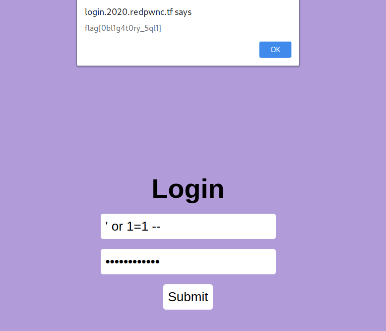

# login

Author: [roerohan](https://github.com/roerohan)

Basic SQL Injection.

# Requirements

- Basic knowledge of SQL Injection.

# Source

- https://login.2020.redpwnc.tf/

# Exploitation

This is a beginner SQL Injection challenge. Just pass the username and the password as `' or 1=1 -- `, it will return the flag in an `alert`.



The flag is:

```
flag{0bl1g4t0ry_5ql1}
```